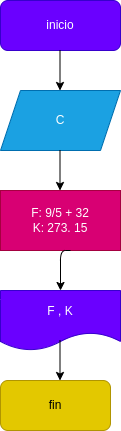

 # temperatura
programa de temperatura para realizar converiones de temperatura

## programa para convertir una cantidad de grados celcius los grados fahrenheit y los grados kelvin 

# analisis

variables de entrada 

c: grados celcius o centigrados

variables de salida 

f: grados fahrenheit 
k: grados kelvin

# Diseño

  

# CONSTRUCCION

ejercisio n.2 hacer un programa que pase de los grados celcius a grados kelvin fahrenheit

F: = (c + (9/5)+ 32)
k: = c + 237.15

## ESTE ARCHIVO ESTA ESCRITO EN LENGUAJE MARKDOWN
